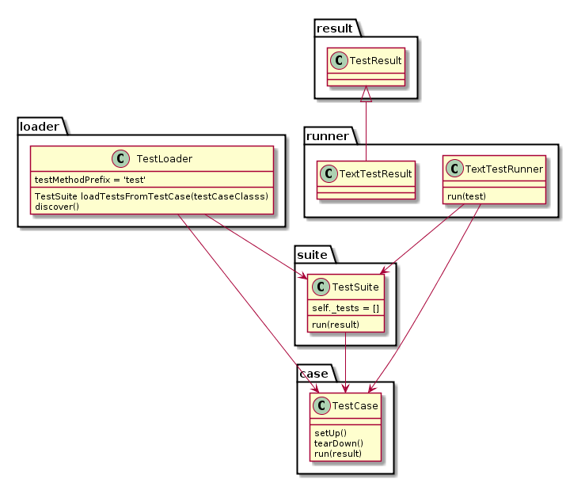

# Unittest整理

###  深入理解unittest-整理
http://www.cnblogs.com/hackerain/p/3682019.html



* Testcase的实例就是测试用例，测试用例是一个完成的测试流程，包括测试环境的的搭建setUp，执行测试代码run，以及测试后环境的还原tearDown
多个测试用例集合在一起就是TestSuite，而TestSuite也可以嵌套TestSuite
* TestLoader是用例是加载TestCase到TestSuite中的，其中有几个loadTestsFrom_()方法，就是从各个地方来寻找TestCase，
创建他们的实例，然后add到TestSuite中，在返回一个TestSuite的实例。
* TextTestRunner是用来执行测试用例的，其中的run(test)会执行TestSuite/TestCase中的run(result)方法
测试结果会保存在TextTestResult实例中，其中包括执行多少的测试用例，成功多少，失败多少等信息

* 所以测试流程是，我们写好TestCase，然后用TestLoader将TestCase加载到TestSuite中，然后用TextTestRunner运行TestCase，
将运行结果记录在TestResult中，整个过程继承在unittest.main模块中。
* fixture通过覆盖TestCase中的setUp()和tearDown()方法来实现，比如测试用例中需要访问数据库，
那么可以在setUp()中建立数据库连接以及一些初始化，在tearDown()中清除在数据库中产生的数据，然后关闭连接
* 通过看TestLoader驶入和加载测试用例的，就知道在一个类中什么是测试用例，到底是这个类还是类中具体的测试方法。（可参见连接中举出的例子）
有的测试用例的fixture是相同的，如果每个测试用例都单独携程TestCase的话，会有很多的冗余代码，所以将他们写在同一类中的不同方法。


### 深入解读Python的unittest并拓展HTMLTestRunner
http://www.cnblogs.com/hhudaqiang/p/6596043.html

* 自动化测试人员需要熟悉知道unittest的执行原理和相关模块的作用。
需求：
1. 如何利用unittest执行流程而非单元测试
2. 如何控制unittest的执行顺序
3. 流程测试中如何动态的控制是否跳过某个test的执行
4. 在报告中显示出用例的执行情况，是否skip

* unittest=TestCase+TestResult，只要熟知这两个模块，你就能为所欲为。
我们平时用到的大多是这些模块，但是最后执行的是TestCase中的run方法，并把结果给
TestResult或者它的子类

```python
import unittest
class Mydemo(unittest.TestCase):
    def setUp(self):
        self.a=1
    def test1(self):
        print "i am test1 the value of a is {}".format(self.a)
    def test2(self):
        print "i am test2 the value of a is {}".format(self.a)
    def  test3(self):
        print "i am test3 the value of a is {}".format(self.a)
if __name__ == '__main__':
    unittest.main()
```
* unittest.main()是什么，还有其他写法来执行么
进入main()函数中，最终执行的是TestProgram这个类，这个类的构造函数部分
代码是
```python
        if argv is None:
            argv = sys.argv#得到当前模块的绝对路径
        self.exit = exit
        self.failfast = failfast
        self.catchbreak = catchbreak
        self.verbosity = verbosity
        self.buffer = buffer
        self.defaultTest = defaultTest
        self.testRunner = testRunner
        self.testLoader = testLoader
        self.progName = os.path.basename(argv[0])
        self.parseArgs(argv)#查找当前module的Testsuite
        self.runTests()#执行测试
```
上面的代码执行的就是两个步骤，一个步骤是要找到测试的testcase，并加入到Testsuite中
第二：运行TestSuite并把结果给TestResult

##什么是TestCase
实例了一个TestCase类的叫一个TestCase
```python
import unittest
class Mydemo(unittest.TestCase):
    def setUp(self):
        self.a=1
    def Mytest1(self):
        print "i am Mytest1 the value of a is {}".format(self.a)
    def Mytest2(self):
        print "i am Mytest2 the value of a is {}".format(self.a)
    def Mytest3(self):
        print "i am Mytest3 the value of a is {}".format(self.a)
if __name__ == '__main__':
    test_runner=unittest.TextTestRunner()
    test_suit=unittest.TestSuite()
    test_suit.addTests(map(Mydemo,["Mytest1","Mytest2","Mytest3"]))
    test_runner.run(test_suit)
```
运行结果是：
```python
...
i am Mytest1 the value of a is 1
----------------------------------------------------------------------
i am Mytest2 the value of a is 1
Ran 3 tests in 0.000s
i am Mytest3 the value of a is 1
 
OK
```
上面的TestCase并没有用test开头，为什么大家默认要用test开头来写呢，我们打开C:\Python27\Lib\unittest\loader.py
这个模块在其中有写defaultTestLoader = TestLoader()，而这个TestLoader这个类的第一行就看见
testMethodPrefix = ‘test’，也就是说如果你用了defaultTestLoader，那么默认的就是以
test开头的方法为一个测试用例，具体可以在TestLoader类中的getTestCaseNames得到实现，
```python
def getTestCaseNames(self, testCaseClass):
        """Return a sorted sequence of method names found within testCaseClass
        """
        def isTestMethod(attrname, testCaseClass=testCaseClass,
                         prefix=self.testMethodPrefix):
            return attrname.startswith(prefix) and \
                hasattr(getattr(testCaseClass, attrname), '__call__')#返回一个testCaseClass有__call__方法且attrname以prefix开头的为一个testcase
        testFnNames = filter(isTestMethod, dir(testCaseClass))
        if self.sortTestMethodsUsing:
            testFnNames.sort(key=_CmpToKey(self.sortTestMethodsUsing))
        return testFnNames
```
上文中提到的unittest.main()其实用的是defaultTestLoader。

具体看看TestCase这个类，下面列出一些主要的方法：
setUp() 在每个test执行前都要执行的方法
tearDown()在每个test执行后都要执行的方法（不管用例是否执行成功）
setUpClass()在测试类中所有test开始之前，执行一次且必须使用到TestSuite(只有在TestSuite的run方法中
才对其调用)
tearDownClass()在一个测试类中所哟的test结束之后，执行一次且必须使用TestSuite(只有在TestSuite的run方法
才对其调用)
run()这个是unittest的核心，具体自己看源码，所有最终case的执行都会归结到该
run方法中

还有个很重要的变量_resultForDoCleanups私有变量，存储TestResult的执行结果，
这个在构建后面的skip用到。

TestCase类中的所有的测试用例都是独立的，testcase就是TestCase类的实例对象，
所以不要企图在某个test存储或者改变一个变量，下个test中能用到，除非用到setUpClass
看个例子：
```python
import unittest
class Mydemo(unittest.TestCase):
    def test1(self):
        self.a = 1
        print("i am test1 and the value is {}".format(self.a)) 
        
    def test2(self):
        pirnt("i am test1 and the value is {}".format(self.a))

if __name__ == '__main__':
    unittest.main()
```
结果是：
```python
C:\Python27\python.exe D:/Moudle/module_1/test4.py
i am test1 the value of a is 1
.E
======================================================================
ERROR: test2 (__main__.Mydemo)
----------------------------------------------------------------------
Traceback (most recent call last):
  File "D:/Moudle/module_1/test4.py", line 7, in test2
    print "i am test2 the value of a is {}".format(self.a)
AttributeError: 'Mydemo' object has no attribute 'a'

----------------------------------------------------------------------
Ran 2 tests in 0.001s

FAILED (errors=1)
```
这就说明TestCase中的所有的测试用例都是独立的，每个testcase就是由TestCase实例化的
一个独立的实例，其实也是能共享数据的，不能共享的原因是刚才用的self是实例对象的属性，嫩共享我们
就必须要用类属性，比如：
```python
import unittest
class Mydemo(unittest.TestCase):
    def test1(self):
        Mydemo.a = 1
        print("i am test1 the value a is {}".format(self.a))
    def test2(self):
        print("i am test2 the value of a is {}".format(Mydemo.a))

if __name__ = '__main__':
    unittest.main()
```
结果是：
```python
i am test1 the value of a is 1
..
i am test2 the value of a is 1
----------------------------------------------------------------------
Ran 2 tests in 0.000s
 
OK
```
TestSuite,我们打开C:\Python27\Lib\unittest\suite.py找到TestSuite，他继承于
BaseTestSuite，主要的属性就那么几个：
1. self._tests这个私有变量里面放的是所有的TestCase或者TestSuite
2. run()方法，方法如下：
```python
def run(self, result, debug=False):
        topLevel = False
        if getattr(result, '_testRunEntered', False) is False:
            result._testRunEntered = topLevel = True
 
        for test in self:#这个循环会一直遍历_tests中的变量
            if result.shouldStop:
                break
            if _isnotsuite(test):
                self._tearDownPreviousClass(test, result)
                self._handleModuleFixture(test, result)
                self._handleClassSetUp(test, result)#这一句提到了调用setUpClass的规则
                result._previousTestClass = test.__class__
 
                if (getattr(test.__class__, '_classSetupFailed', False) or
                    getattr(result, '_moduleSetUpFailed', False)):
                    continue
 
            if not debug:
                test(result)#如果是TestSuit继续调用该方法，如果是TestCase则调用TestCase中的run方法
            else:
                test.debug()
 
        if topLevel:
            self._tearDownPreviousClass(None, result)
            self._handleModuleTearDown(result)
            result._testRunEntered = False
        return result
```
注释1：
self是一个迭代对象，一直遍历上文中提到的self._tests变量
注释2：
我们看看_handleClassSetUp中的方法，发现在用例的执行过程中，每个TestCase类置灰调用一次setUpClass()方法，同理
tearDownClass,对这一点我们举例：
```python
import unittest
class Mydemo(unittest.TestCase):
    @classmethod
    def setUpClass(cls):
        print "I am setUpClass"
    def test1(self):
        print "i am test1 "
    def test2(self):
        print "i am test2"
    @classmethod
    def tearDownClass(cls):
        print "I am tearDownClass"
if __name__ == '__main__':
    unittest.main()
```
结果：
```python
C:\Python27\python.exe D:/Moudle/module_1/test4.py
I am setUpClass
..
i am test1 
----------------------------------------------------------------------
i am test2
Ran 2 tests in 0.001s
I am tearDownClass

OK
```
说明类方法setUpClass和tearDownClass只执行了一遍，这就回答了我们第一个问题了：在setUpClass中
启动浏览器，执行完所有流程后关闭浏览器，举一个简单的demo就是：
```python


```


